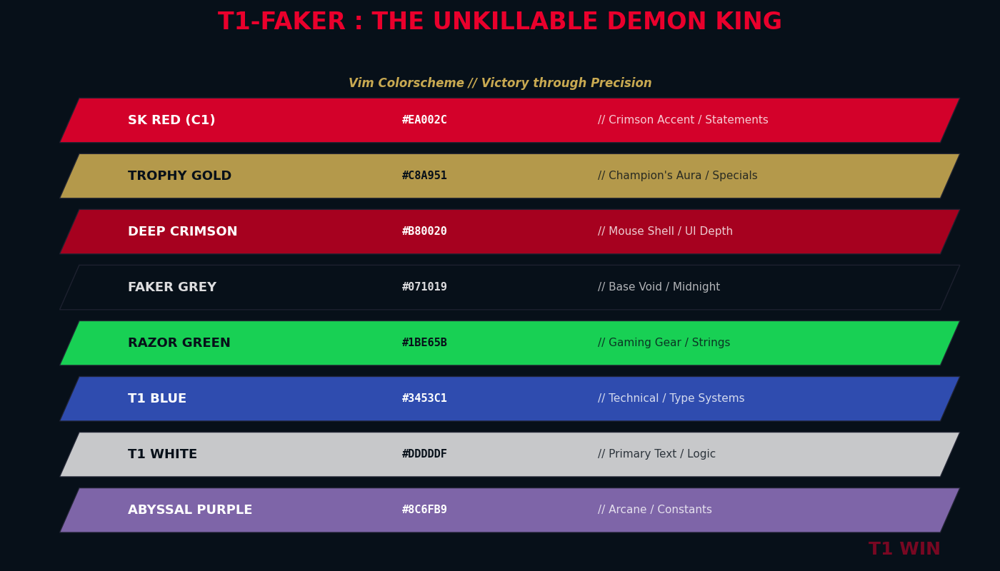
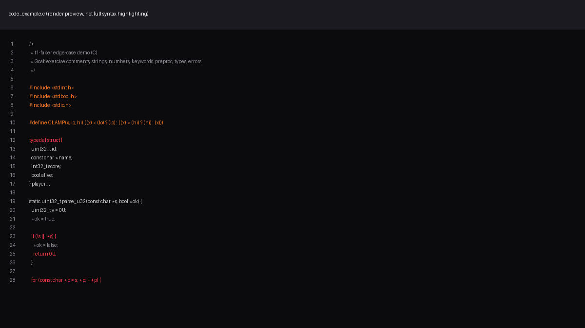

# T1 Faker

Black/White/Crimson Vim colorscheme inspired by T1 team colors, with subtle "Faker Edition" mouse-style crimson accents.

## Install (Vundle)

Add this line to your vimrc:

```vim
Plugin 'yourname/t1-faker.vim'
```

Then install:

```vim
:PluginInstall
```

Enable the theme:

```vim
set termguicolors
colorscheme t1-faker
```

## Files

- `colors/t1-faker.vim`: Vim colorscheme
- `t1-faker.json`: Optional VS Code theme export (same palette)
- `preview.png`: Palette preview
- `code_example.c` / `code_example.png`: Demo snippet and rendered preview

## Preview



- Designed for truecolor terminals (`set termguicolors`).
- If your terminal is not truecolor, reduce saturation by changing `red2` / `gold0`.
